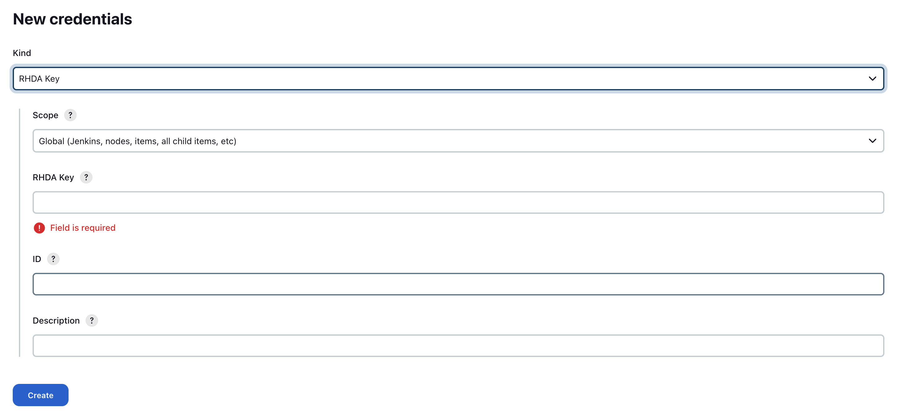
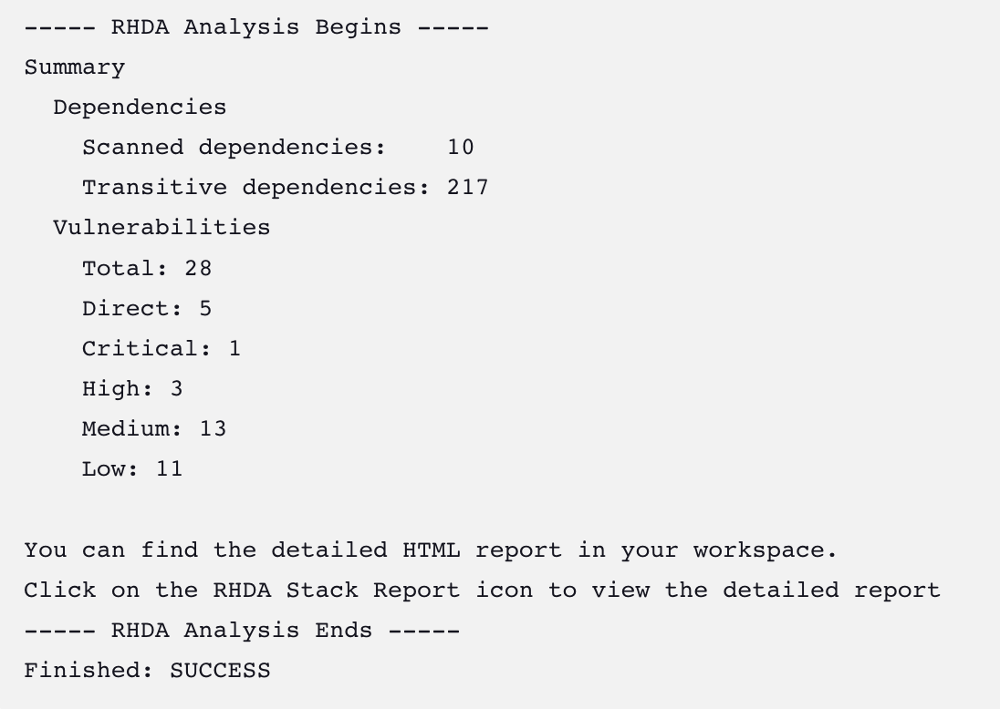
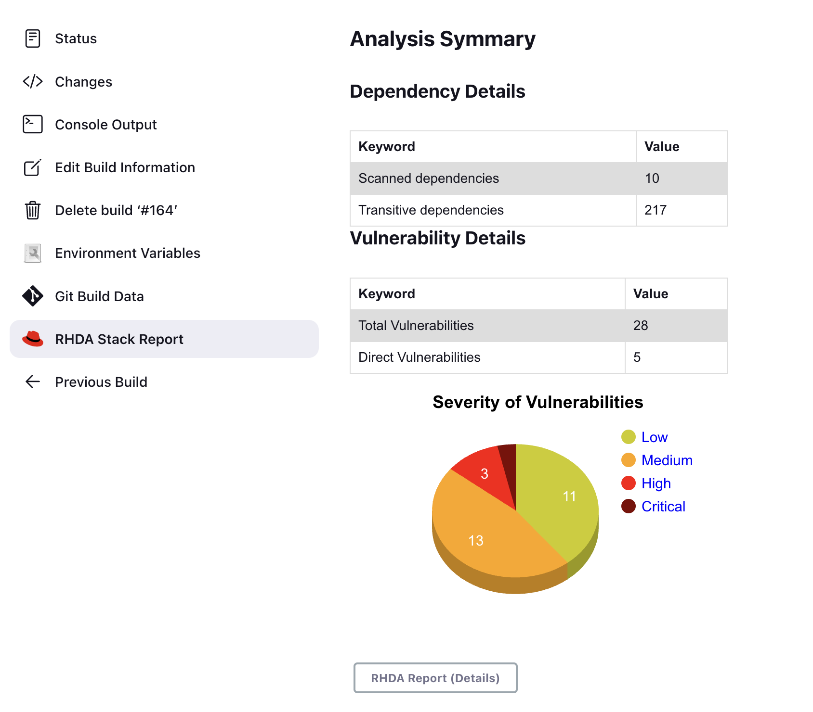
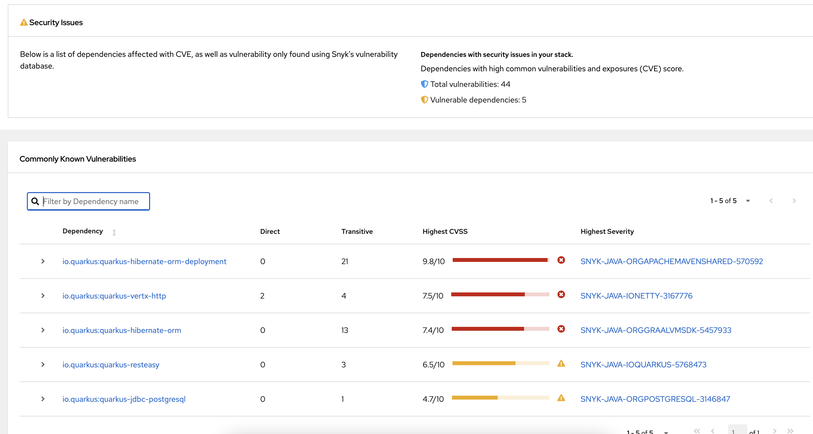

***

# Table of Contents
- [Introduction](#red-hat-dependency-analysis)
- [How To Use The Plugin](#how-to-use-the-plugin)
  - [Admin Steps](#admin-steps)
    - [Generate RHDA Key](#1-generate-rhda-key)
    - [Install The Plugin](#2-install-the-redhat-codeready-dependency-analysis-jenkins-plugin)
    - [RHDA Credentials](#3-rhda-credentials)
    - [Configuration](#4-configuration)
      - [1. Build Step](#option-i--as-a-build-step)
      - [2. Pipeline Task](#option-ii--as-a-pipeline-task)
- [Results](#results)
  - [1. Console Output](#1-console-output)
  - [2. RHDA Stack Report](#2-rhda-stack-report)
  - [3. Detailed RHDA Stack Report](#3-detailed-rhda-stack-report)
- [Snyk Registration](#snyk-registration)
  - [1. Via SNYK website](#1-via-rhda-stack-report-ui)
  - [2. Via CLI](#2-via-cli)
  - 
# Red Hat Dependency Analytics
Red Hat dependency analysis is a jenkins plugin developed by **Red Hat Inc**. RHDA (red hat dependency analytics) is powered by **Snyk Intel Vulnerability DB**, which is the most advanced and accurate open source vulnerability database in the industry. It adds value with the latest, fastest and more number of vulnerabilities derived from numerous sources.

'RHDA Report' with Insights about your application dependencies:
- Flags a security vulnerability(CVE) and suggests a remedial version
- Shows Github popularity metrics along with latest version
- Suggests a project level license, check for conflicts between dependency licences
- AI based guidance for additional, alternative dependencies

The plugin can be used in jenkins as a pipeline task or as a build step.

## How to use the plugin
### Admin Steps
### 1. Generate RHDA Key
- Download the RHDA CLI tool on your system. Click [here](https://github.com/fabric8-analytics/cli-tools/releases "here") to download.
- Follow the instructions for the installation and run `crda auth` command to generate the rhda key. Copy this key.

### 2. Install the redhat-codeready-dependency-analysis jenkins plugin
- Goto the jenkins dashboard -> Manage Jenkins -> Manage Plugins.
- Seach for `redhat-codeready-dependency-analysis` and install.

### 3. RHDA credentials
- Goto jenkins dashboard -> Manage Jenkins -> Manage Credentials. Select the global domain -> Add Credentials.
- Select the option `RHDA Key` in the Kind option.
- Let the scope be global.
- Enter a valid RHDA Key which was generated via the rhda auth command using the RHDA CLI.
- Let the ID field blank. Jenkins will generate the ID. You can also provide an id of your own if you wish to.
- Give some description for the identification of the credentials.

### 4. Configuration
Make sure that the Path is updated to point to the corresponding executables, like mvn, pip etc.
<h5>Customization</h5>

There is a way to set a custom Maven path using <em>Environment Variables</em>. 
- Click on Manage Jenkins -> System. Scroll down to Global properties/Environment Variables.
- Set Name: EXHORT_MVN_PATH and Value: /path/to/custom/mvn.

#### Option I- As a build step
- Click on Configure -> Build Trigger -> Add Build Step. Select `Invoke Red Hat Codeready Dependency Analysis (RHDA)`.
- Filepath (Mandatory): Provide the filepath for the manifest file. We currently support the following
	- Maven: pom.xml
	- Python: requirements.txt
	- Npm: package.json
	- Golang: go.mod
- RHDA Key (Mandatory): The Id generated by jenkins from the step 3. You also have an option to create a new key/id if you have access to it.
- Usage Statistics (Optional): Consent given to red hat to collect some usage statistics to improve the plugin and report. Default consent is false.

  
#### Option II- As a pipeline task
- Its just a single line that you need to add in your pipeline script.
`crdaAnalysis file:'manifest file path', crdaKeyId:'crda key id', consentTelemetry:true`
The value description remains the same as provided in the Option I.
User can also use the pipeline snippet generator to generate the command.

- It returns 3 different exit status code
	- 0: Analysis is successful and there were no vulnerabilities found in the dependency stack.
	- 1: Analysis encountered an error.
	- 2: Analysis is successful and it found 1 or more vulnerabilities in the dependency stack.

## Results
There are a total 3 ways to view the results of the analysis.
### 1. Console Output
This provides the count and types of vulnerabilities found in the dependency stack. This data is generated for every build and can be viewed in the corresponding console log. It also provides a link to the detailed report.

### 2. RHDA Stack Report
After every successful analysis, you can find a new icon added in the left panel named
`RHDA Stack Report` . Click on this icon to view the report in graphical form. Here too, we provide a button to redirect to the detailed stack report UI.

### 3. Detailed RHDA Stack Report
The stack report can be accessed via 2 ways, as mentioned in point number 1 (via url) and 2 (via button click). The report provides comprehensive details about each vulnerability, each dependency in the stack along with the license analysis and the recommended companions.

## Snyk Registration
There are 2 ways to register with Snyk

### 1. Via SNYK website

https://docs.snyk.io/getting-started/quickstart/create-a-snyk-account

### 2. Via CLI
If you have a Snyk token, then the same can be used at the time of `crda auth` cli command execution by providing the snyk token.
